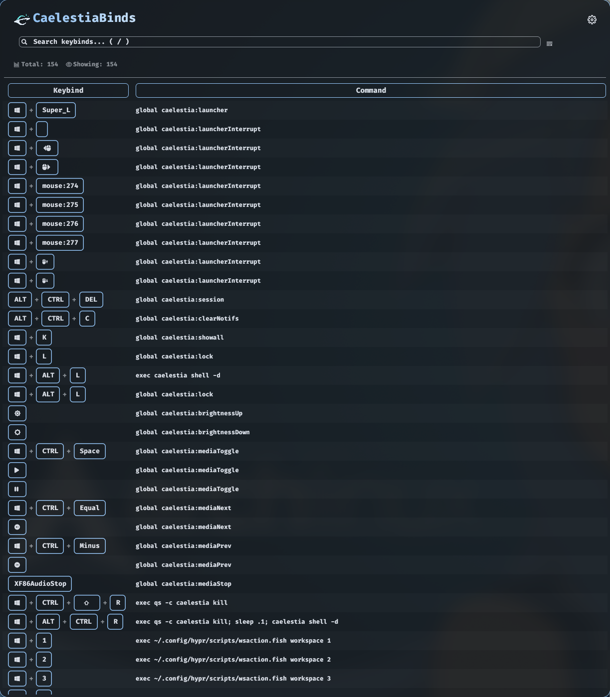

# CaelestiaBind – Caelestia Keybind Viewer

## Screenshot
<details>
<summary>App screenshot</summary>



</details>


## Requirements

- Linux + Hyprland running
- `hyprctl` available in PATH
- Rust toolchain: `cargo`
- Caelestia shell: https://github.com/caelestia-dots/caelestia
## Install / Build

```bash
# Clone
git clone https://github.com/Shinobu420/CaelestiaBinds.git

cd CaelestiaBinds

# set execute permission
chmod +x ./install.sh

# run the installer
./install.sh
```

## Usage
- start the app via app-launcher, terminal (caelestia-binds), or keybind (Super+Enter)
- Press `/` (can be changed) to focus the search bar.

## License

SourceCode: MIT

Font: SIL OFL 1.1
